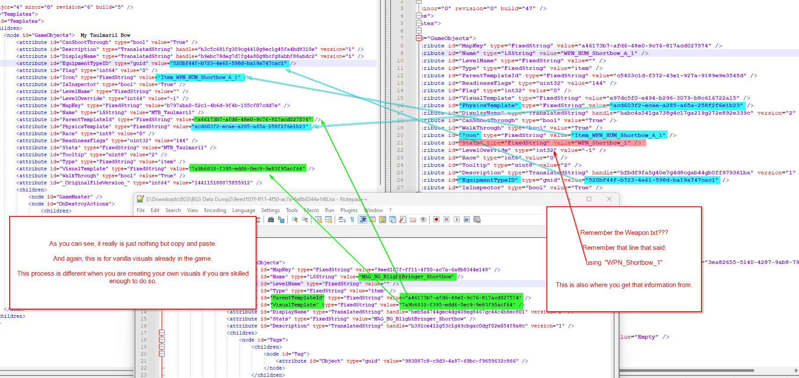

## Some mods I'm using for ~~stealing ideas~~ Inspiration

- [Ring of Convenience at Baldur's Gate 3 Nexus - Mods and community](https://www.nexusmods.com/baldursgate3/mods/1942)
- [Camp Shoes of Advantages at Baldur's Gate 3 Nexus - Mods and community](https://www.nexusmods.com/baldursgate3/mods/852)

## Copy of [Step by Step - A basic Modding Tutorial at Baldur's Gate 3 Nexus - Mods and community](https://www.nexusmods.com/baldursgate3/mods/1514?tab=description)

All credit to [legend0fthefall](https://www.nexusmods.com/baldursgate3/users/324699)

- [MyTaulmarilBow](MyTaulmarilBow)
- [Template Folders and Files](Template Folders and Files)
- [Unzipped with final pak file](Unzipped with final pak file)

